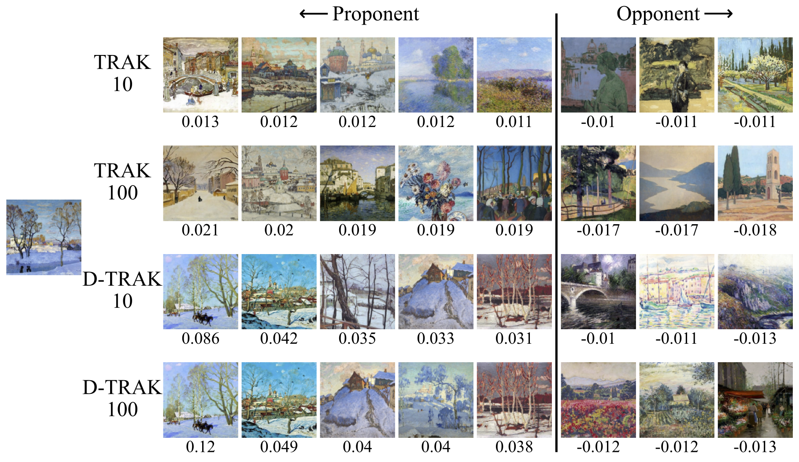

<h1 align='center' style="text-align:center; font-weight:bold; font-size:2.0em;letter-spacing:2.0px;">
                Intriguing Properties of Data Attribution on Diffusion Models </h1>

<!-- <p align='center' style=font-size:1.2em;>
<b>
<em>arXiv-Preprint, 2023</em> <br>
</b>
</p> -->

<p align='left' style="text-align:left;font-size:1.2em;">
<b>
    [<a href="https://sail-sg.github.io/D-TRAK" target="_blank" style="text-decoration: none;">Project Page</a>] |
    [<a href="https://arxiv.org/abs/2311.00500" target="_blank" style="text-decoration: none;">arXiv</a>] | 
    [<a href="https://drive.google.com/drive/folders/1Ko1CI-nWo3NHWYpxfX2Un1t9UsuddVHX?usp=sharing" target="_blank" style="text-decoration: none;">Data Repository</a>]&nbsp;
</b>
</p>

----------------------------------------------------------------------

### TL, DR: 
```
We report counter-intuitive observations that theoretically unjustified design choices 
for attributing diffusion models empirically outperform previous baselines 
by a large margin.
```

<!--  -->
<!--  -->
<p>
<figure>

  <figcaption>Proponents and opponents visualization on ArtBench-2 using TRAK and D-TRAK with
various # of timesteps (10 or 100). For each sample of interest, 5 most positive influential training
samples and 3 most negative influential training samples are given together with the influence scores
(below each sample).</figcaption>
</figure>
</p>
<br>

|Counterfactual visualization on CIFAR-2|Counterfactual visualization on ArtBench-2|
| :-: | :-: |
|||
|||
|||


# How to run
## Quickstart
Check [quickstart.ipynb](quickstart.ipynb) to conduct data attribution on pre-trained diffusion models loaded from huggingface directly!

## Replicating the paper's results

### Setup
To get started, follow these steps:

1. **Clone the GitHub Repository:** Begin by cloning the repository using the command:
   ```shell
   git clone https://github.com/sail-sg/D-TRAK.git
   ```
2. **Set Up Python Environment:** Ensure you have a version 3.8.
   name:
   ```shell
   conda create -n dtrak python=3.8 -y
   conda activate dtrak
   ```
3. **Install Dependencies:** Install the necessary dependencies by running:
   ```shell
   pip install -r requirements.txt
   ```

### Commands for LDS evaluation
We provide the commands to run experiments on CIFAR-2. 
It is easy to transfer to other datasets.

1. **Data pre-processing:** 
    ```shell
    cd CIFAR2
    ```
    Run [00_EDA.ipynb](CIFAR2/00_EDA.ipynb) to create dataset splits and subsets of the training set.

4. **Train a diffusion model and generate images:** 
    ```shell
    bash scripts/run_train.sh 0 18888 5000-0.5
    bash scripts/run_gen.sh 0 0 5000-0.5
    ```
5. **Construct the LDS benchmark:** 
    
    Train 64 models corresponding to 64 subsets of the training set
    ```shell
    bash scripts/run_lds_val_sub.sh 0 18888 5000-0.5 0 63
    ```
    Evaluate the model outputs on the validation set
    ```shell
    bash scripts/run_eval_lds_val_sub.sh 0 0 5000-0.5 idx_val.pkl 0 63
    bash scripts/run_eval_lds_val_sub.sh 0 1 5000-0.5 idx_val.pkl 0 63
    bash scripts/run_eval_lds_val_sub.sh 0 2 5000-0.5 idx_val.pkl 0 63
    ```
    Evaluate the model outputs on the generation set
    ```shell
    bash scripts/run_eval_lds_val_sub.sh 0 0 5000-0.5 idx_gen.pkl 0 63
    bash scripts/run_eval_lds_val_sub.sh 0 1 5000-0.5 idx_gen.pkl 0 63
    bash scripts/run_eval_lds_val_sub.sh 0 2 5000-0.5 idx_gen.pkl 0 63
    ```
6. **Compute gradients:** 

    We shard the training set into 5 parts, each has 1000 examples.

    Use the following commands to compute the gradients to be used for TRAK. 

    ```shell
    bash scripts/run_grad.sh 0 0 5000-0.5 idx-train.pkl 0 ddpm/checkpoint-8000 loss uniform 10 32768
    bash scripts/run_grad.sh 0 0 5000-0.5 idx-train.pkl 1 ddpm/checkpoint-8000 loss uniform 10 32768
    bash scripts/run_grad.sh 0 0 5000-0.5 idx-train.pkl 2 ddpm/checkpoint-8000 loss uniform 10 32768
    bash scripts/run_grad.sh 0 0 5000-0.5 idx-train.pkl 3 ddpm/checkpoint-8000 loss uniform 10 32768
    bash scripts/run_grad.sh 0 0 5000-0.5 idx-train.pkl 4 ddpm/checkpoint-8000 loss uniform 10 32768
    bash scripts/run_grad.sh 0 0 5000-0.5 idx-val.pkl 0 ddpm/checkpoint-8000 loss uniform 10 32768
    bash scripts/run_grad.sh 0 0 5000-0.5 idx-gen.pkl 0 ddpm/checkpoint-8000 loss uniform 10 32768
    ```

    Use the following commands to compute the gradients to be used for D-TRAK. 

    ```shell
    bash scripts/run_grad.sh 0 0 5000-0.5 idx-train.pkl 0 ddpm/checkpoint-8000 mean-squared-l2-norm uniform 10 32768
    bash scripts/run_grad.sh 0 0 5000-0.5 idx-train.pkl 1 ddpm/checkpoint-8000 mean-squared-l2-norm uniform 10 32768
    bash scripts/run_grad.sh 0 0 5000-0.5 idx-train.pkl 2 ddpm/checkpoint-8000 mean-squared-l2-norm uniform 10 32768
    bash scripts/run_grad.sh 0 0 5000-0.5 idx-train.pkl 3 ddpm/checkpoint-8000 mean-squared-l2-norm uniform 10 32768
    bash scripts/run_grad.sh 0 0 5000-0.5 idx-train.pkl 4 ddpm/checkpoint-8000 mean-squared-l2-norm uniform 10 32768
    bash scripts/run_grad.sh 0 0 5000-0.5 idx-val.pkl 0 ddpm/checkpoint-8000 mean-squared-l2-norm uniform 10 32768
    bash scripts/run_grad.sh 0 0 5000-0.5 idx-gen.pkl 0 ddpm/checkpoint-8000 mean-squared-l2-norm uniform 10 32768
    ```

7. **Compute the TRAK/D-TRAK attributions and evaluate the LDS scores**

    Run notebooks in [methods/04_if](CIFAR2/methods/04_if).

    The implementations of other baselines can also be found in [methods](CIFAR2/methods).

### Commands for counterfactual evaluation

1. **Data pre-processing**

    Run this [notebook](CIFAR2/methods/04_if/get_indices_gen.ipynb) first to get the indices of those training examples to be removed.

2. **Retrain models after removing the top-influenctial training examples**
    ```shell
    bash scripts/run_counter.sh 0 18888 5000-0.5 0 59
    ```

3. **Generate images using the retrained models**

    Run [02_counter.ipynb](CIFAR2/02_counter.ipynb)

4. **Measure l2 distance**

    Run [03_counter_eval_l2.ipynb](CIFAR2/03_counter_eval_l2.ipynb)

5. **Measure CLIP cosine similarity**

    Run [03_counter_eval_clip.ipynb](CIFAR2/03_counter_eval_clip.ipynb)

# Bibtex
If you find this project useful in your research, please consider citing our paper:

```
@inproceedings{
zheng2023intriguing,
title={Intriguing Properties of Data Attribution on Diffusion Models},
  author={Zheng, Xiaosen and Pang, Tianyu and Du, Chao and Jiang, Jing and Lin, Min},
booktitle={NeurIPS Workshop on Attributing Model Behavior at Scale},
year={2023},
}

```
